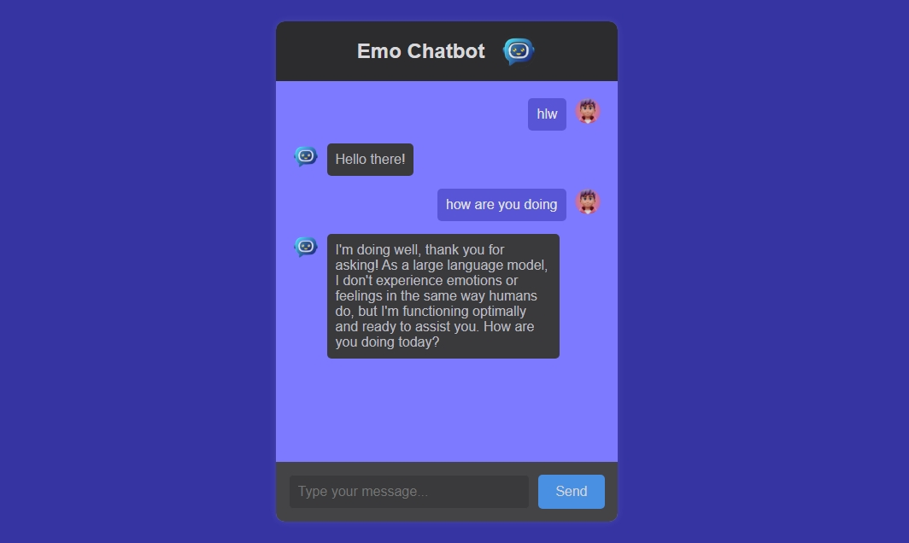

# EmoChat Extension

> **A sleek, Gemini-powered AI chatbot as a browser extension.**
> Chat with Emo right from your browser – fast, secure, and delightfully intelligent.

🔗 **Repository:** [github.com/Kishan-shr/emoChat-extension](https://github.com/Kishan-shr/emoChat-extension)

---

## ✨ Features

* 💬 Real-time AI chat powered by **Gemini Flash** (Google LLM)
* 🧠 Typing effect for realistic conversation flow
* 🧊 Modern dark-themed UI with profile avatars
* ⚡ Lightweight and blazing fast
* 💻 Runs entirely in your browser as an extension

---

## 🚀 Getting Started

### 1️⃣ Clone the Repository

```bash
git clone https://github.com/Kishan-shr/emoChat-extension
cd emoChat-extension
```

### 2️⃣ Create `config.js`

Create a file named `config.js` in the root of the extension folder:

```js
// config.js
const CONFIG = {
  GEMINI_API_KEY: "YOUR_GEMINI_API_KEY_HERE"
};
```

Get your API key from [Google AI Studio](https://makersuite.google.com/app) and paste it in the file.


```gitignore
config.js
```

### 3️⃣ Load the Extension in Chrome

1. Go to `chrome://extensions/`
2. Enable **Developer Mode** (top-right)
3. Click **Load Unpacked**
4. Select the project folder

You're all set to chat with Emo! 🧠💬

---

## 💻 Tech Stack

| Technology                                                             | Purpose                   |
| ---------------------------------------------------------------------- | ------------------------- |
|  HTML               | Structure                 |
|  CSS                   | Styling (dark UI)         |
|  JavaScript       | Logic, API, Typing effect |
|  Gemini API  | Natural Language Model    |
|  Chrome Extension | Platform                  |

---


---

## 📸 Screenshots & Demo




---

## 🧠 Gemini API — Pros & Cons

### ✅ Advantages:

* Fast responses via `gemini-1.5-flash`
* Free tier with generous limits
* Great for summaries, Q\&A, text generation

### ⚠️ Limitations:

* No memory / context over time
* Rate limits apply
* Output may occasionally need refining

---


## 🔐 Permissions Required (in `manifest.json`)

```json
"matches": [
  "<all_urls>",
  "https://generativelanguage.googleapis.com/*"
]
```


---

## 🛠️ Contributing

Pull requests welcome! For major changes, please open an issue first to discuss what you’d like to change.

---

## 📄 License

MIT © [Kishan Sharma](https://github.com/Kishan-shr)
